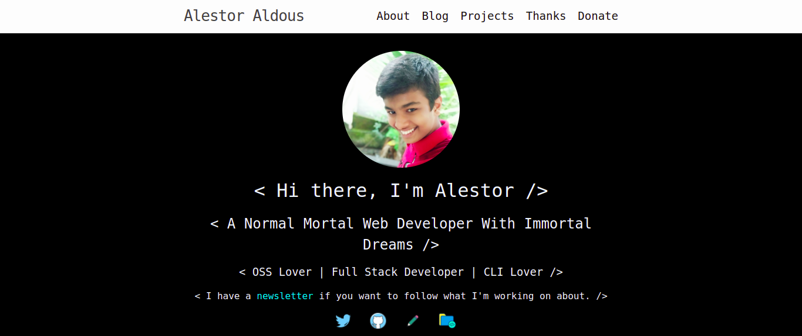
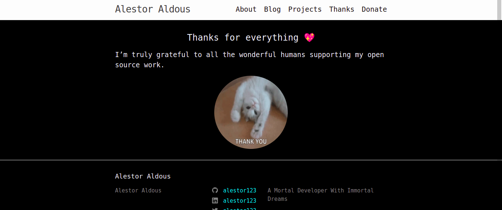
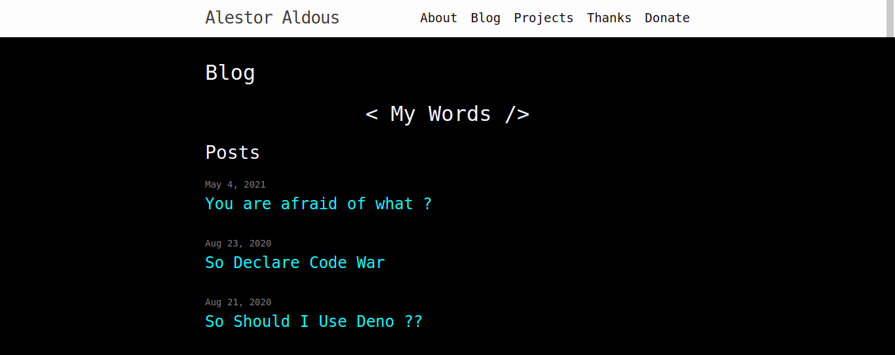

# [alestor123](http://alestor123.github.io/)
> My personal webpage

The website targets the latest version of Chrome, Safari, and Firefox.


<p align=center>

<a href="https://github.com/alestor123/alestor123.github.io/issues">
</a>

</p>

# Screenshots : 







# Dev
RUN :


```
bundle exec jekyll serve --livereload --open-url
```


## 💖 [Donate](https://alestor123.is-a.dev/donate)


## Author

👤 **Alestor Aldous**

- Twitter: [@alestor123](https://twitter.com/alestor123)
- Github: [@alestor123](https://github.com/alestor123)


## 📝 License
> MIT

Copyright © 2022 [Alestor Aldous](https://github.com/alestor123).<br />